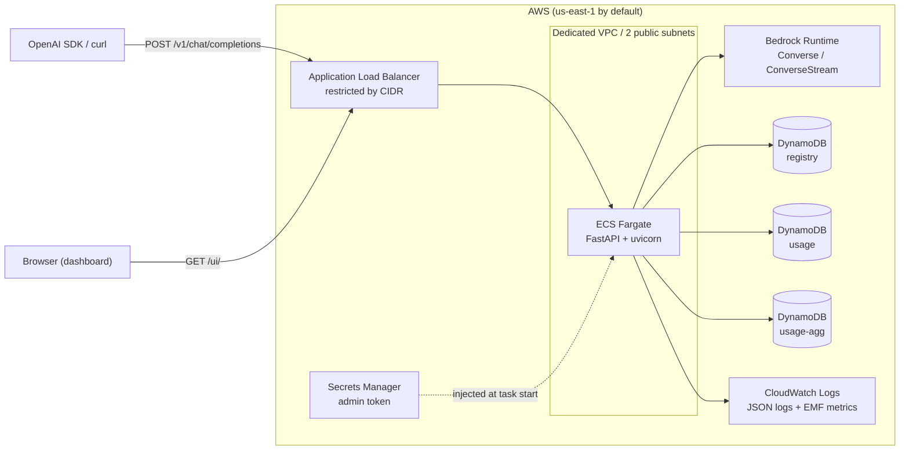
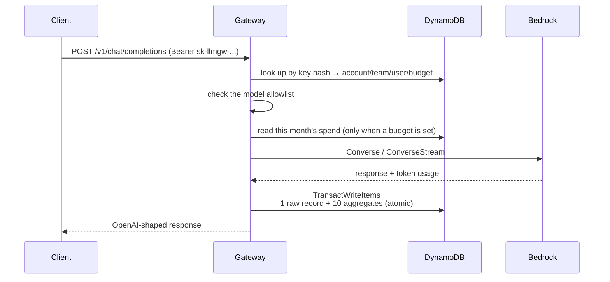
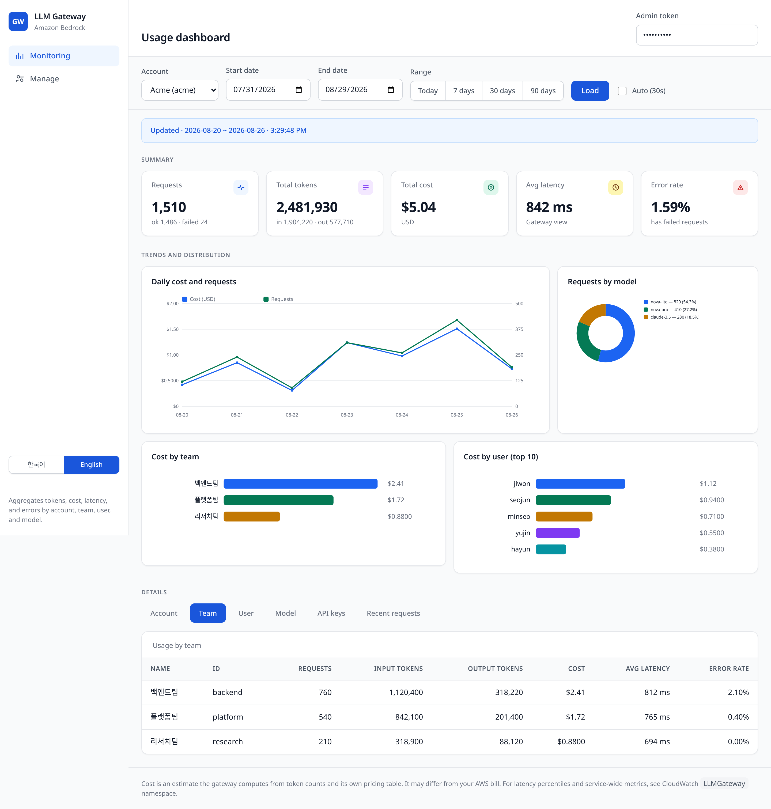

# LLM Gateway

[한국어](README.md) · **English**

An **OpenAI-compatible API gateway** that sits in front of Amazon Bedrock. It
solves three problems organizations hit when they hand LLM access to many teams
and users.

1. **You cannot tell who spent what.** A Bedrock bill arrives per account only.
   You cannot split it by team or by user.
2. **You cannot control access.** Handing out IAM credentials makes it hard to
   restrict models or enforce budget limits.
3. **You have to rewrite existing code.** Moving an application built on the
   OpenAI SDK to Bedrock means reshaping requests and responses.

This gateway exposes OpenAI-compatible endpoints, so you point `base_url` at it
and you are done. For every request it records tokens, cost, latency, and errors
along the **account / team / user / model** axes, and it enforces a model
allowlist and a monthly budget per API key.

With AWS credentials alone, one command creates everything from the VPC to the
DynamoDB tables.

---

## Table of contents

- [Architecture](#architecture)
- [Prerequisites](#prerequisites)
- [Deploy](#deploy)
- [Access control (multiple clients)](#access-control-multiple-clients)
- [Usage](#usage)
- [Identity provider integration (OIDC)](#identity-provider-integration-oidc)
- [Monitoring dashboard](#monitoring-dashboard)
- [Running locally](#running-locally)
- [Tests](#tests)
- [Environment variables](#environment-variables)
- [Deployment parameters](#deployment-parameters)
- [Cost](#cost)
- [Observability and troubleshooting](#observability-and-troubleshooting)
- [Teardown](#teardown)
- [Security notes](#security-notes)
- [Documentation](#documentation)

---

## Architecture



**Request flow**



Writing the raw usage record and updating the aggregates is **one transaction**.
The sort key is a `usage_id` the server generates per request, and the same
value is passed as `ClientRequestToken`, so a retransmitted transaction does not
double-count the aggregates.

The client-supplied `X-Request-Id` is **not an aggregation key.** Every Bedrock
call costs real money, so reusing the same ID still records one entry per call.
Skipping aggregation would let the monthly budget check pass forever and would
drop the spend from cost allocation.

**AWS services in use**

| Purpose | Service |
|---|---|
| Compute | ECS Fargate |
| Entry point | Application Load Balancer |
| LLM | Amazon Bedrock (Converse API) |
| Data | 3 DynamoDB tables (on-demand, PITR, SSE-KMS) |
| Secrets | Secrets Manager (token generated automatically) |
| Registry | ECR (scan on push, immutable tags) |
| Observability | CloudWatch Logs, EMF custom metrics, 4 alarms, SNS |
| Network | Dedicated VPC, IGW, S3/DynamoDB gateway endpoints |
| IaC | CloudFormation, 2 stacks |

The reasoning behind each design decision lives in [`docs/adr/`](docs/adr/).

---

## Prerequisites

| Item | Version | Purpose |
|---|---|---|
| AWS credentials | - | Target account |
| AWS CLI | v2 | Stack deployment, secret lookup |
| Docker | 20+ | Image build |
| `jq` | 1.6+ | JSON handling in the deploy script |
| `git` | 2.x | Image tag generation |
| Python | 3.13 | Local development and tests (not needed to deploy) |

**Turn on Bedrock model access first.** In the AWS console go to Bedrock →
Model access and enable the models you plan to use. Without this the deployment
still succeeds but every LLM call fails with `AccessDeniedException`. The deploy
script checks this at startup and warns you.

Deploying requires create and update permissions for CloudFormation, EC2 (VPC),
ELBv2, ECS, ECR, DynamoDB, IAM, Secrets Manager, CloudWatch, SNS, and
Application Auto Scaling.

---

## Deploy

```bash
git clone <this repository>
cd llm-gateway-bedrock

# Open only the public IP of the client you connect from.
./scripts/deploy.sh --allowed-cidr "$(curl -s https://checkip.amazonaws.com)/32"
```

`--allowed-cidr` is **required** and may be given more than once. `0.0.0.0/0`
and every `/0` prefix are rejected.

Adding and removing clients after deployment takes seconds and needs **no stack
redeployment**.

```bash
./scripts/manage_access.sh add-me --label "home-laptop"
./scripts/manage_access.sh add 203.0.113.0/28 --label "head-office"
./scripts/manage_access.sh list
./scripts/manage_access.sh remove 198.51.100.5/32
./scripts/manage_access.sh check     # can this client reach the gateway?
```

See [Access control](#access-control-multiple-clients) for details.

What the script does:

1. Verify tools, credentials, and Bedrock access; check for leftover resources
2. Create the ECR stack
3. Build and push the image (skipped when the same tag already exists)
4. Create the application stack (VPC, ALB, ECS, DynamoDB, IAM, alarms)
5. Wait until `/healthz` returns 200
6. Seed 2 demo accounts, 4 teams, 6 users, and 6 keys, then generate usage with
   real Bedrock calls
7. Run the smoke test (auth boundaries, streaming, aggregation-bypass defense,
   4 aggregation axes, cost calculation)
8. Print connection details

The first deployment takes 8 to 12 minutes. Re-running is safe.

Key options:

```bash
# Production shape (HTTPS + 2 tasks + alarm email)
./scripts/deploy.sh \
  --allowed-cidr 203.0.113.10/32 \
  --env prod --desired-count 2 \
  --certificate-arn arn:aws:acm:us-east-1:<account-id>:certificate/<id> \
  --alarm-email ops@example.com

# Open several clients at once
./scripts/deploy.sh --allowed-cidr 203.0.113.10/32 \
                    --allowed-cidr 198.51.100.5/32

# Narrow the default model policy
./scripts/deploy.sh --allowed-cidr 203.0.113.10/32 \
  --allowed-models "amazon.nova-lite-v1:0,amazon.nova-pro-v1:0"

# Gateway in Seoul, Bedrock calls in us-east-1 (model availability differs)
./scripts/deploy.sh --allowed-cidr 203.0.113.10/32 \
  --region ap-northeast-2 --bedrock-region us-east-1

# Narrow IAM to specific models and keep raw usage for 30 days
./scripts/deploy.sh --allowed-cidr 203.0.113.10/32 \
  --allowed-model-arn "arn:aws:bedrock:*::foundation-model/amazon.nova-*" \
  --usage-ttl-days 30
```

Run `./scripts/deploy.sh --help` for the full option list.

---

## Access control (multiple clients)

The ALB security group references **one managed prefix list**. However many
clients you have, the security group keeps one rule per protocol, and adding or
removing a client needs no CloudFormation stack update. Changes usually apply
within seconds.

The prefix list is **created empty**. Nothing can reach the gateway until you
explicitly add a client.

```bash
# Add this client (its public IP as a /32)
./scripts/manage_access.sh add-me --label "home-laptop"

# Add a specific CIDR
./scripts/manage_access.sh add 203.0.113.10/32 --label "office-macbook"
./scripts/manage_access.sh add 198.51.100.0/28 --label "head-office-range"

# List
./scripts/manage_access.sh list

# Remove
./scripts/manage_access.sh remove 203.0.113.10/32

# Can this client reach the gateway? (makes a real HTTP call)
./scripts/manage_access.sh check

# Overall status (including whether a 0.0.0.0/0 rule exists)
./scripts/manage_access.sh status
```

Example output:

```
== Allowed clients (llmgw-dev-app)
   prefix list pl-0abc123def456

   CIDR                   Description
   ---------------------- ------------------------
   192.0.2.10/32          bootstrap by deploy.sh
   203.0.113.10/32        office-macbook
   198.51.100.0/28        head-office-range

   used 3 / max 20
```

### Constraints and cautions

- The limit is `AccessListMaxEntries` (20 by default). It can only be **raised
  after creation, never lowered.** To raise it, change the parameter and
  redeploy.
- The script rejects `0.0.0.0/0` and any range wider than `/8`.
- CloudFormation does not manage prefix list entries. That is why you can change
  clients without redeploying, and it also means someone could insert a wide
  range directly with the AWS CLI. `smoke_test.sh` checks on every deployment
  that no `0.0.0.0/0` inbound rule exists.
- Do not edit the security group rules in the console. The next deployment
  reverts them.

---

## Usage

Use the URL and admin token printed after deployment. CloudFormation generates
the token and stores it in Secrets Manager; no human chooses it.

```bash
GATEWAY_URL="http://<alb-dns>"
ADMIN_TOKEN="$(aws secretsmanager get-secret-value --region us-east-1 \
  --secret-id llmgw/dev/admin-token --query SecretString --output text | jq -r .admin_token)"
```

### Creating accounts, teams, users, and keys

A default deployment already creates demo accounts (`acme`, `beta`) along with
teams, users, and keys. The examples below use new IDs that do not collide with
them. To start without demo data, deploy with `./scripts/deploy.sh --no-seed`.
Recreating an existing ID returns `409 already_exists`.

```bash
# Account (monthly budget 500 USD)
curl -X POST "$GATEWAY_URL/admin/accounts" \
  -H "X-Admin-Token: $ADMIN_TOKEN" -H 'Content-Type: application/json' \
  -d '{"account_id":"contoso","name":"Contoso Ltd","monthly_budget_usd":500}'

# Team (monthly budget 200 USD)
curl -X POST "$GATEWAY_URL/admin/accounts/contoso/teams" \
  -H "X-Admin-Token: $ADMIN_TOKEN" -H 'Content-Type: application/json' \
  -d '{"team_id":"backend","name":"Backend","monthly_budget_usd":200}'

# User
curl -X POST "$GATEWAY_URL/admin/accounts/contoso/users" \
  -H "X-Admin-Token: $ADMIN_TOKEN" -H 'Content-Type: application/json' \
  -d '{"user_id":"jiwon","name":"Jiwon Kim","team_id":"backend","monthly_budget_usd":100}'

# API key (the plaintext key appears only in this response)
curl -X POST "$GATEWAY_URL/admin/accounts/contoso/keys" \
  -H "X-Admin-Token: $ADMIN_TOKEN" -H 'Content-Type: application/json' \
  -d '{"user_id":"jiwon","name":"laptop","allowed_models":["amazon.nova-lite-v1:0"]}'
```

Budgets can be set at four levels — account, team, user, and key — and
**exceeding any one of them** blocks the request with `429 insufficient_quota`.
Leaving a budget unset means unlimited, and in that case the gateway does not
even issue the DynamoDB read used for the budget check.

### Calling with the OpenAI SDK

The OpenAI SDK is not a dependency of this repository. Install it in your
application environment first.

```bash
pip install "openai==3.6.0"
```

```python
from openai import OpenAI

client = OpenAI(
    base_url="http://<alb-dns>/v1",
    api_key="sk-llmgw-dev-...",  # the key you issued above
)

response = client.chat.completions.create(
    model="amazon.nova-lite-v1:0",
    messages=[{"role": "user", "content": "Hello"}],
    max_tokens=256,
)
print(response.choices[0].message.content)

# Streaming
for chunk in client.chat.completions.create(
    model="amazon.nova-lite-v1:0",
    messages=[{"role": "user", "content": "Count from 1 to 5"}],
    stream=True,
):
    delta = chunk.choices[0].delta.content
    if delta:
        print(delta, end="", flush=True)
```

### Calling with curl

```bash
curl -X POST "$GATEWAY_URL/v1/chat/completions" \
  -H "Authorization: Bearer sk-llmgw-dev-..." \
  -H 'Content-Type: application/json' \
  -H "X-Request-Id: $(uuidgen)" \
  -d '{
    "model": "amazon.nova-lite-v1:0",
    "messages": [{"role":"user","content":"Hello"}],
    "max_tokens": 256
  }'
```

If you send `X-Request-Id`, that value becomes the **correlation ID** and shows
up unchanged in the response header, in every log line, and in the usage record.
Use it to trace one request through the logs. It is not an aggregation key.
Every Bedrock call costs real money, so retrying with the same ID records one
entry per call.

### Supported endpoints

| Method | Path | Auth | Description |
|---|---|---|---|
| `POST` | `/v1/chat/completions` | API key or OIDC token | Chat completion (streaming supported) |
| `GET` | `/v1/models` | API key or OIDC token | Models this credential may use |
| `GET` | `/healthz` | none | Shallow health check (for the ALB) |
| `GET` | `/readyz` | none | Verifies DynamoDB and Bedrock access |
| `GET` | `/ui/` | Admin token (entered in the browser) | Monitoring dashboard |
| `GET` | `/docs`, `/openapi.json` | none | API specification |
| `*` | `/admin/*` | `X-Admin-Token` or OIDC admin token | Manage accounts, teams, users, keys |
| `GET` | `/analytics/*` | `X-Admin-Token` or OIDC admin token | Query usage aggregates |
| `GET` | `/auth/me` | OIDC token | Show how your token maps to account/team/user |
| `*` | `/auth/keys` | OIDC token | Issue, list, and revoke your own API keys |

The full specification lives in [`docs/openapi.json`](docs/openapi.json) and is
browsable interactively at `/docs` on a deployed gateway.

Fields in the OpenAI specification that have no Bedrock Converse equivalent
(`presence_penalty`, `logit_bias`, and so on) are accepted and ignored. `n > 1`,
which would change the result, is rejected explicitly.

---

## Identity provider integration (OIDC)

You can attach the identity provider your organization already uses — Amazon
Cognito, Okta, Azure AD, Google — **per account**. Once attached:

- Users call the gateway with an IdP access token instead of an API key.
- Members of an admin group manage that account **without the shared admin
  token**.
- Developers issue their own API keys through `POST /auth/keys`.

Configure it from the dashboard under **Manage → Identity provider**, or through
the API:

```bash
curl -X PUT "$GATEWAY_URL/admin/accounts/contoso/auth" \
  -H "X-Admin-Token: $ADMIN_TOKEN" -H 'Content-Type: application/json' \
  -d '{
    "issuer": "https://cognito-idp.us-east-1.amazonaws.com/us-east-1_XXXXXXXXX",
    "audience": "<app-client-id>",
    "user_claim": "email",
    "team_claim": "custom:team_id",
    "groups_claim": "cognito:groups",
    "admin_groups": "contoso-admins",
    "auto_provision": false
  }'
```

Then call the gateway with the token your IdP issued:

```bash
curl -X POST "$GATEWAY_URL/v1/chat/completions" \
  -H "Authorization: Bearer <idp-access-token>" \
  -H 'Content-Type: application/json' \
  -d '{"model":"amazon.nova-lite-v1:0","messages":[{"role":"user","content":"Hello"}]}'
```

### How authority is scoped

| Credential | Scope | Intended use |
|---|---|---|
| `X-Admin-Token` (shared) | All accounts | Bootstrap and break-glass |
| OIDC token in the account's `admin_groups` | **That account only** | Customer administrators |
| OIDC token in `LLMGW_OIDC_PLATFORM_ADMIN_GROUPS` | All accounts | Service operators |

Scope is enforced in one place, from the `account_id` in the request path, so
every account-scoped endpoint is protected automatically and a newly added
endpoint cannot forget the check. A test enumerates the admin routes from the
OpenAPI specification and asserts that all of them return 403 for an account
outside the caller's scope.

### Things worth knowing

- **An issuer cannot be shared across accounts.** The gateway decides which
  account a token belongs to from its `iss`, so allowing a second account to
  claim the same issuer would let it impersonate users of the first. A
  conditional write rejects it.
- **Only asymmetric signatures are accepted.** `HS*` and `none` are refused,
  which blocks algorithm substitution.
- **The JWKS URL is validated.** Only `https` is allowed, and the hostname is
  resolved so that private, link-local, loopback, and reserved addresses are
  rejected. This matters because on Fargate `169.254.170.2` serves task role
  credentials, so an unvalidated URL would be an SSRF path. The URL is
  re-checked immediately before each fetch to block DNS rebinding.
- **Auto-provisioning requires a budget.** Turning it on without one would let
  anyone who can sign in to the IdP call Bedrock without limit, at the account
  owner's expense, so the setting is rejected at configuration time.
- **Self-service key issuance cannot escalate privileges.** The account and user
  come from the token, never the request body; requested models are intersected
  with what the account allows; the budget cannot be set by the requester; and
  another user's key is not even acknowledged to exist.
- Disabling the configuration blocks that account's OIDC authentication
  immediately, without deleting the settings, so you can respond to an IdP
  incident and roll back.

---

## Monitoring dashboard

Open `http://<alb-dns>/ui/` and enter the admin token. The token is kept in
`sessionStorage` only, so it disappears when you close the tab.



Switch the interface language between Korean and English from the sidebar. The
choice is stored in the browser and persists across visits. The Korean screen is
shown in the [Korean README](README.md#모니터링-대시보드).

What it shows:

- **KPIs** — request count (success/failure), total tokens (input/output), total
  cost, average latency, error rate
- **Daily cost and request count** trend (separate left and right axes)
- **Cost by team** bar chart
- **Top 10 cost by user** bar chart
- **Requests by model** donut chart
- **Six detail tabs** — account / team / user / model / API key / recent requests

It supports range presets (today / 7 / 30 / 90 days), arbitrary ranges, and a
30-second auto refresh. The maximum query range is 93 days.

The interface follows the [Flowbite](https://flowbite.com) design system
(Tailwind palette and component specifications). The library itself is not
imported; the same specifications are implemented directly in CSS. Flowbite
assumes Tailwind utility classes, which would require a CDN or an npm build,
whereas this gateway must render correctly on a private network with no internet
access and its image build carries no npm toolchain. Light and dark modes are
both supported, and no decorative emoji are used.

Charts are drawn directly as SVG with no external library, for the same reasons:
they work where CDN access is blocked, and the container build needs no npm
toolchain.

Everything the dashboard reads comes from pre-aggregated tables, so its response
time does not change as request volume grows.

---

## Running locally

```bash
python3.13 -m venv .venv
./.venv/bin/pip install -r requirements-dev.txt

export LLMGW_ENV=local
export AWS_REGION=us-east-1
export LLMGW_ADMIN_TOKEN=local-dev-token
export LLMGW_REGISTRY_TABLE=llmgw-dev-registry
export LLMGW_USAGE_TABLE=llmgw-dev-usage
export LLMGW_USAGE_AGG_TABLE=llmgw-dev-usage-agg
export LLMGW_BIND_HOST=127.0.0.1

PYTHONPATH=src ./.venv/bin/python -m llmgw
```

Open `http://127.0.0.1:8080/ui/`. DynamoDB and Bedrock calls go to real AWS, so
you need valid credentials and deployed tables.

Running in a container:

```bash
docker build -t llmgw:local .
docker run --rm -p 8080:8080 \
  -e AWS_REGION=us-east-1 \
  -e LLMGW_ADMIN_TOKEN=local-dev-token \
  -e AWS_ACCESS_KEY_ID -e AWS_SECRET_ACCESS_KEY -e AWS_SESSION_TOKEN \
  llmgw:local
```

---

## Tests

Unit tests do not call real AWS. DynamoDB is replaced by `moto`, and Bedrock by
`botocore.stub.Stubber` together with test doubles. Fast regression checks for
the dashboard charts and admin UI use the Node harness in `tests/js/`. Core
admin UI flows, desktop and mobile layouts, and language switching are verified
separately with Python Playwright against real Chromium.

```bash
# Install Chromium (once)
./.venv/bin/python -m playwright install chromium

# Unit tests, Node harness, and coverage
./.venv/bin/python -m pytest -m "not browser" \
  --cov=llmgw --cov-report=term-missing

# Real-browser admin UI and i18n
./.venv/bin/python -m pytest -m browser
```

Full verification before committing:

```bash
./.venv/bin/isort src tests scripts
./.venv/bin/black src tests scripts
./.venv/bin/ruff check src tests scripts
./.venv/bin/mypy
./.venv/bin/python -m pytest -m "not browser"
./.venv/bin/python -m pytest -m browser
./.venv/bin/cfn-lint infra/*.yaml
shellcheck scripts/*.sh
./.venv/bin/python scripts/export_openapi.py   # refresh the spec
```

End-to-end test against a deployed environment:

```bash
LLMGW_BASE_URL="$GATEWAY_URL" LLMGW_ADMIN_TOKEN="$ADMIN_TOKEN" \
  ./scripts/smoke_test.sh
```

---

## Environment variables

These are the values the container reads. They all use the `LLMGW_` prefix.
**Values are not listed here.** CloudFormation sets them on the task definition,
so the only time you set them yourself is when running locally.

| Name | Required | Default | Purpose |
|---|---|---|---|
| `LLMGW_ENV` | no | `dev` | Environment identifier. Used in resource names and the API key prefix |
| `LLMGW_AWS_REGION` / `AWS_REGION` | no | `us-east-1` | Region for DynamoDB and other calls |
| `LLMGW_BEDROCK_REGION` | no | (`AWS_REGION`) | Region for Bedrock calls |
| `LLMGW_REGISTRY_TABLE` | no | `llmgw-dev-registry` | Account/team/user/key table |
| `LLMGW_USAGE_TABLE` | no | `llmgw-dev-usage` | Per-request usage table |
| `LLMGW_USAGE_AGG_TABLE` | no | `llmgw-dev-usage-agg` | Aggregate table |
| `LLMGW_ADMIN_TOKEN` | **yes** | (empty) | Admin API and dashboard token. Empty means the admin API returns 503 |
| `LLMGW_OIDC_PLATFORM_ADMIN_GROUPS` | no | (empty) | Groups granted platform-wide admin authority. Comma separated |
| `LLMGW_DEFAULT_ALLOWED_MODELS` | no | (empty) | Applied when a key has no allowlist. Comma separated. Empty means all models |
| `LLMGW_USAGE_TTL_DAYS` | no | `90` | Retention for raw usage records |
| `LLMGW_PRICING_FILE` | no | in-package `pricing.json` | Path to the model pricing table |
| `LLMGW_LOG_LEVEL` | no | `INFO` | Log level |
| `LLMGW_SERVICE_NAME` | no | `llmgw` | `service` field in logs |
| `LLMGW_METRICS_NAMESPACE` | no | `LLMGateway` | EMF metric namespace |
| `LLMGW_REQUEST_TIMEOUT_SECONDS` | no | `300` | Bedrock read timeout |
| `LLMGW_BIND_HOST` | no | `0.0.0.0` | Bind address when running locally |
| `LLMGW_PORT` | no | `8080` | Port when running locally |

When `LLMGW_ADMIN_TOKEN` is empty the admin API **returns 503 rather than
letting requests through**. Interpreting an unset token as "no authentication
required" would expose the admin API to the internet.

---

## Deployment parameters

The main parameters of `infra/app.yaml`. See the template's `Parameters` section
for the complete list.

| Parameter | Default | Description |
|---|---|---|
| `AccessListMaxEntries` | `20` | Maximum entries in the allow list. Can only be raised after creation |
| `CertificateArn` | empty | ACM certificate. Supplying it enables HTTPS plus an HTTP→HTTPS redirect |
| `DesiredCount` | `1` | Steady-state task count. 2 or more is recommended for prod |
| `MaxCount` | `4` | Autoscaling ceiling (target tracking at 60% CPU) |
| `TaskCpu` / `TaskMemory` | `512` / `1024` | 0.5 vCPU / 1 GiB |
| `VpcCidr` | `10.60.0.0/16` | CIDR of the VPC to create |
| `LogRetentionDays` | `30` | Log retention. Infinite retention is not selectable |
| `UsageTtlDays` | `90` | TTL for raw usage records |
| `AllowedBedrockModelArn` | `arn:aws:bedrock:*::foundation-model/*` | Model scope the task role may invoke |
| `AlarmEmail` | empty | Alarm recipient. Requires confirming the subscription email |

---

## Cost

Rough figures for `us-east-1`. Check the
[AWS pricing pages](https://aws.amazon.com/pricing/) for actual rates.

| Item | Billing unit | Estimated monthly, default setup |
|---|---|---|
| ALB | hours + LCU | about $17 |
| Fargate | vCPU-seconds + GB-seconds | 0.5 vCPU / 1 GiB × 1 task ≈ about $18 |
| DynamoDB | per request (on-demand) | near $0 when idle |
| ECR | storage | about $0.1 for a few images |
| Secrets Manager | per secret | about $0.40 |
| CloudWatch Logs | ingestion + storage | proportional to traffic; about $1 at small scale |
| VPC gateway endpoints | none | $0 |
| **Total (idle)** | | **about $37** |
| Bedrock | tokens | proportional to usage; billed separately |

Each request adds a DynamoDB transaction of 11 items, roughly 22 WRU. One
million requests is therefore around $27. See
[`docs/adr/0002`](docs/adr/0002-datastore-dynamodb.md) for the reasoning.

Not using a NAT Gateway saves about $40 a month, at the cost of assigning public
IPs to the tasks. The reasoning is in
[`docs/adr/0003`](docs/adr/0003-network-and-exposure.md).

Deleting everything with `./scripts/teardown.sh` stops the charges.

---

## Observability and troubleshooting

### Logs

```bash
# Live
aws logs tail /ecs/llmgw-dev --region us-east-1 --follow

# Trace one request (every log line carries correlation_id)
aws logs filter-log-events --region us-east-1 \
  --log-group-name /ecs/llmgw-dev \
  --filter-pattern '{ $.correlation_id = "abc-123" }'

# Errors only
aws logs filter-log-events --region us-east-1 \
  --log-group-name /ecs/llmgw-dev \
  --filter-pattern '{ $.level = "ERROR" }'
```

Every log line is a single JSON object. `service`, `level`, `correlation_id`, and
`location` are always present.

### Metrics

CloudWatch custom namespace `LLMGateway`:

| Metric | Dimensions | Meaning |
|---|---|---|
| `Requests` | `Environment`, `Model` | Request count |
| `Errors` | `Environment`, `Model` | Failure count |
| `InputTokens`, `OutputTokens` | `Environment`, `Model` | Token counts |
| `CostUsd` | `Environment`, `Model` | Computed cost |
| `LatencyMs` | `Environment`, `Model` | Processing time (p50/p95/p99 derivable) |
| `UsageWriteFailures` | `Environment` | Detects lost aggregation |

Account IDs are deliberately not used as metric dimensions. Every dimension
combination is billed separately, so cost would grow with the number of tenants.
Per-account, per-team, and per-user figures come from the dashboard instead.

### Alarms

| Alarm | Condition |
|---|---|
| `llmgw-dev-alb-5xx` | Target 5xx > 5 over 5 minutes |
| `llmgw-dev-latency-p99` | p99 response time > 30 s, 2 periods in a row |
| `llmgw-dev-unhealthy-targets` | Unhealthy targets > 0, 3 periods in a row |
| `llmgw-dev-usage-write-failures` | Usage write failures > 0 |

### Common problems

| Symptom | Cause and action |
|---|---|
| Cannot connect to `/healthz` | This client is not in the allow list. Check with `./scripts/manage_access.sh check` and add it with `add-me` (no redeployment needed) |
| `503 storage_unavailable` | DynamoDB tables missing or task role lacks permission. Check the AWS code in the response message |
| `403 model_not_allowed` | Model is not in the key's `allowed_models`. List what is available with `GET /v1/models` |
| `403` + "Bedrock model access" | Enable the model under Bedrock → Model access in the console |
| `429 insufficient_quota` | One of the account/team/user/key monthly budgets is exceeded. The dashboard shows which axis |
| `404 model_not_found` | The model is EOL or absent in that region (Bedrock `ResourceNotFoundException`). Check with `GET /admin/models` |
| `400 invalid_request` + `ValidationException` | The model ID format is wrong. Use an ID exactly as returned by `GET /v1/models` |
| Dashboard cost is 0, or an "unpriced N requests" warning | The model is missing from the pricing table. Inspect with `./.venv/bin/python scripts/sync_pricing.py`. Current Claude models fall into this case ([details](docs/models-claude.md)) |
| Tasks keep restarting | Check `aws logs tail /ecs/llmgw-dev --since 15m`. The deployment circuit breaker rolls back automatically |

More detailed procedures are in [`docs/runbook.md`](docs/runbook.md).

---

## Teardown

```bash
# Delete the application stack only (ECR images are kept)
./scripts/teardown.sh --env dev --region us-east-1

# Delete ECR, the secret, and leftover tables as well
./scripts/teardown.sh --env dev --region us-east-1 --purge-data
```

You must type `delete` at the confirmation prompt to proceed. `--purge-data`
destroys the usage history permanently.

---

## Security notes

- **The ALB is exposed to the internet.** The allow list starts empty and only
  explicitly added clients get through. The script rejects `/0` and anything
  wider than `/8`, but ranges in the `/8`–`/16` band are still accepted, so keep
  the scope as small as possible.
- **Without a certificate the service runs over HTTP only.** API keys and the
  admin token travel in plaintext. Use it that way for validation only, and
  before real use issue an ACM certificate and redeploy with
  `--certificate-arn`.
- **Plaintext API keys are never stored.** Only a SHA-256 hash is kept, and the
  plaintext appears once in the issuing response. Lose it and you must issue a
  new key.
- **The admin token is generated by CloudFormation.** It never appears in code,
  parameters, or images, and exists only in Secrets Manager.
- **Prefer OIDC over the shared admin token for day-to-day management.** The
  shared token cannot attribute actions to a person and cannot be narrowed. With
  an identity provider connected, an account administrator manages only their own
  account and every admin call is attributed in the logs.
- **IAM is scoped to individual resources.** The three places where a wildcard is
  unavoidable (`ecr:GetAuthorizationToken`, `bedrock:List*`, and the foundation
  model ARN) carry a comment in the template explaining why.
- **`.deploy/` is not committed.** It contains demo key plaintext and is listed
  in `.gitignore`.
- In production, change the DynamoDB tables' `DeletionPolicy` to `Retain`. The
  default is `Delete` for development convenience. The procedure is in the
  runbook's production checklist.

---

## Documentation

| Document | Contents |
|---|---|
| [`docs/architecture.md`](docs/architecture.md) | Components, data model, request flow, scaling limits |
| [`docs/models-claude.md`](docs/models-claude.md) | Claude model integration. Inference profile requirements, pricing gaps, unsupported features |
| [`docs/bedrock-endpoints.md`](docs/bedrock-endpoints.md) | `bedrock-runtime` vs `bedrock-mantle`, and the relationship to the native OpenAI API |
| [`SECURITY.md`](SECURITY.md) | Secret management, access control, IAM, data protection |
| [`CONTRIBUTING.md`](CONTRIBUTING.md) | Development environment, verification commands, commit and PR process |
| [`CODE_OF_CONDUCT.md`](CODE_OF_CONDUCT.md) | Contributor Covenant 2.1 |
| [`docs/runbook.md`](docs/runbook.md) | Deployment, rollback, alarm response, production transition |
| [`docs/adr/0001-compute-ecs-fargate.md`](docs/adr/0001-compute-ecs-fargate.md) | Why Fargate for compute |
| [`docs/adr/0002-datastore-dynamodb.md`](docs/adr/0002-datastore-dynamodb.md) | Choosing DynamoDB and the single-transaction aggregation design |
| [`docs/adr/0003-network-and-exposure.md`](docs/adr/0003-network-and-exposure.md) | Public subnets with public IPs |
| [`docs/adr/0004-region-and-observability.md`](docs/adr/0004-region-and-observability.md) | Region choice and deferring distributed tracing |
| [`docs/openapi.json`](docs/openapi.json) | API specification (a test verifies it matches the code) |
| [`CHANGELOG.md`](CHANGELOG.md) | Release history |

---

## License

[MIT](LICENSE)
