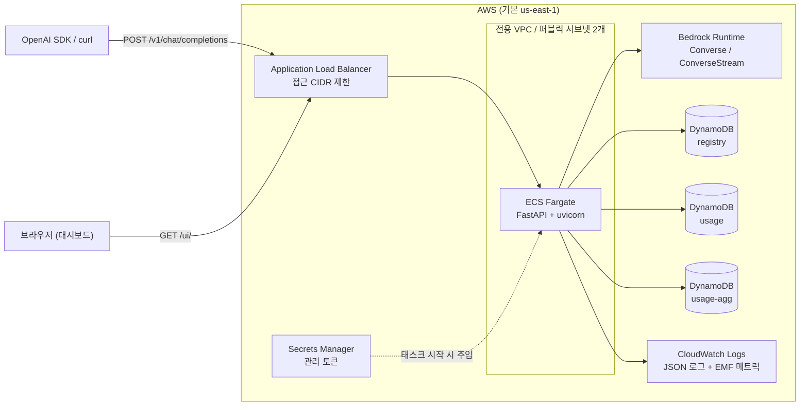
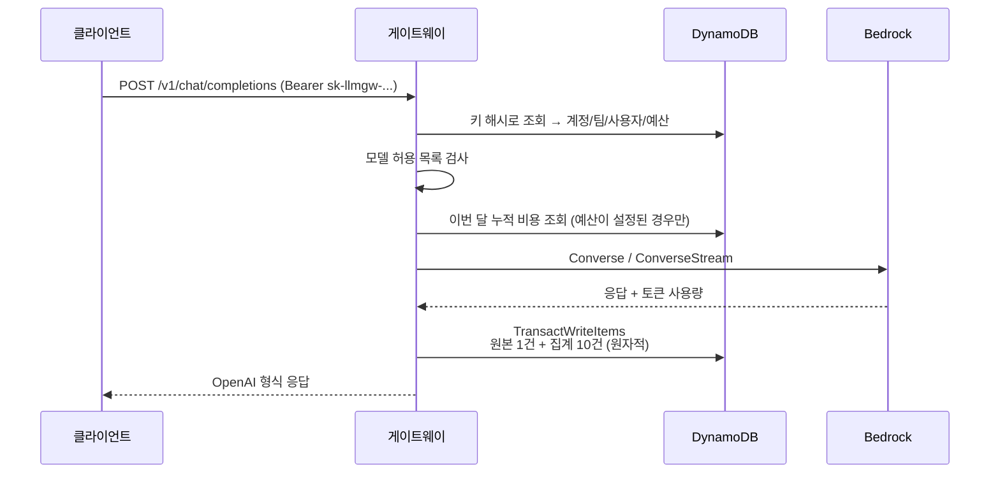
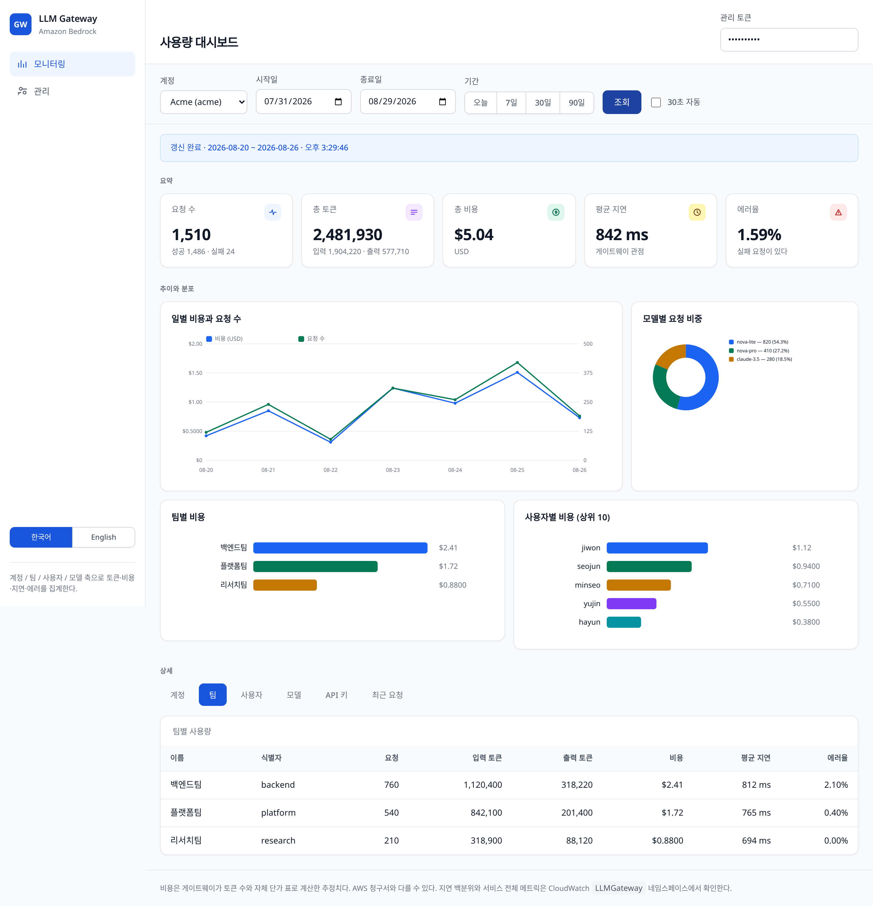

# LLM Gateway

**한국어** · [English](README.en.md)

Amazon Bedrock 앞단에 놓이는 **OpenAI 호환 API 게이트웨이**다. 조직이 여러 팀과
사용자에게 LLM 접근을 나눠줄 때 생기는 세 가지 문제를 해결한다.

1. **누가 얼마를 썼는지 모른다.** Bedrock 청구서는 계정 단위로만 나온다. 팀별,
   사용자별로 쪼갤 수 없다.
2. **접근을 통제할 수 없다.** IAM 자격증명을 나눠주면 모델 제한이나 예산 한도를
   걸기 어렵다.
3. **기존 코드를 고쳐야 한다.** OpenAI SDK 로 짠 애플리케이션을 Bedrock 으로
   옮기려면 요청/응답 형식을 다시 맞춰야 한다.

이 게이트웨이는 OpenAI 호환 엔드포인트를 제공해 `base_url` 만 바꾸면 붙고,
요청마다 **계정 / 팀 / 사용자 / 모델** 축으로 토큰·비용·지연·에러를 기록하고,
API 키 단위로 모델 허용 목록과 월 예산을 강제한다.

AWS 자격증명만 있으면 명령 하나로 VPC 부터 DynamoDB 까지 전부 생성된다.

---

## 목차

- [아키텍처](#아키텍처)
- [사전 요구사항](#사전-요구사항)
- [배포](#배포)
- [태스크를 프라이빗 서브넷에 두기](#태스크를-프라이빗-서브넷에-두기)
- [접근 통제 (다중 단말)](#접근-통제-다중-단말)
- [사용법](#사용법)
- [모니터링 대시보드](#모니터링-대시보드)
- [가드레일](#가드레일)
- [확장점](#확장점)
- [로컬 실행](#로컬-실행)
- [테스트](#테스트)
- [환경변수](#환경변수)
- [배포 파라미터](#배포-파라미터)
- [비용](#비용)
- [관측 지점과 트러블슈팅](#관측-지점과-트러블슈팅)
- [삭제](#삭제)
- [보안상 알아야 할 점](#보안상-알아야-할-점)
- [문서](#문서)

---

## 아키텍처



**요청 처리 흐름**



사용량 원본 쓰기와 집계 갱신은 **하나의 트랜잭션**이다. 정렬 키는 서버가
요청마다 만드는 `usage_id` 이고, 같은 키를 `ClientRequestToken` 으로도 넘겨
네트워크 재전송으로 같은 트랜잭션이 두 번 도착해도 집계가 두 번 더해지지
않는다.

클라이언트가 보낸 `X-Request-Id` 는 **집계 키가 아니다.** Bedrock 호출은 한
번마다 실제 비용이 발생하므로, 같은 ID 를 재사용해도 호출 횟수만큼 기록된다.
집계를 건너뛰면 월 예산 검사가 영원히 통과하고 청구 배분에서도 빠지기
때문이다.

**사용 중인 AWS 서비스**

| 용도 | 서비스 |
|---|---|
| 컴퓨트 | ECS Fargate |
| 진입점 | Application Load Balancer |
| LLM | Amazon Bedrock (Converse API) |
| 데이터 | DynamoDB 3개 (온디맨드, PITR, SSE-KMS) |
| 시크릿 | Secrets Manager (토큰 자동 생성) |
| 레지스트리 | ECR (스캔 온 푸시, 태그 불변) |
| 관측 | CloudWatch Logs, EMF 커스텀 메트릭, 알람 4개, SNS |
| 네트워크 | 전용 VPC, IGW, S3/DynamoDB 게이트웨이 엔드포인트 |
| IaC | CloudFormation 2스택 |

설계 판단의 근거는 [`docs/adr/`](docs/adr/) 에 있다.

---

## 사전 요구사항

| 항목 | 버전 | 용도 |
|---|---|---|
| AWS 자격증명 | - | 배포 대상 계정 |
| AWS CLI | v2 | 스택 배포, 시크릿 조회 |
| Docker | 20+ | 이미지 빌드 |
| `jq` | 1.6+ | 배포 스크립트의 JSON 처리 |
| `git` | 2.x | 이미지 태그 생성 |
| Python | 3.13 | 로컬 개발과 테스트 (배포에는 불필요) |

**Bedrock 모델 액세스를 먼저 켜야 한다.** AWS 콘솔 → Bedrock → Model access 에서
사용할 모델을 활성화한다. 활성화하지 않으면 배포는 성공하지만 모든 LLM 호출이
`AccessDeniedException` 으로 실패한다. 배포 스크립트가 시작 시 확인해 경고한다.

배포에 필요한 IAM 권한은 CloudFormation, EC2(VPC), ELBv2, ECS, ECR, DynamoDB,
IAM, Secrets Manager, CloudWatch, SNS, Application Auto Scaling 에 대한 생성·수정
권한이다.

---

## 배포

설치 경로는 세 가지다. 목적에 맞는 것을 고른다.

| 경로 | Docker 필요 | 용도 |
|---|---|---|
| **사전 빌드 이미지** | 아니오 | 평가·빠른 시작 |
| **계정 내 private ECR** | 아니오(복사만) | 프로덕션 |
| **소스에서 빌드** | 예 | 기여·수정 |

### 사전 빌드 이미지로 설치 (Docker 불필요)

```bash
git clone <이 리포지토리>
cd llm-gateway-bedrock

./scripts/deploy.sh --allowed-cidr "$(curl -s https://checkip.amazonaws.com)/32" \
  --image ghcr.io/jeonghun-app/llm-gateway-bedrock:v2.1.1
```

**데이터는 당신의 AWS 계정을 벗어나지 않는다.** 이미지를 GitHub Container
Registry 에서 받아오지만, 그것은 배포 리전과 무관하다. 게이트웨이, DynamoDB
테이블, 로그, Bedrock 호출은 모두 `--region` 으로 지정한 리전(기본
`us-east-1`)의 당신 계정 안에서 일어난다. 프롬프트와 응답 본문은 애초에
저장하지 않는다.

이미지에는 시크릿이 없다. `src/` 와 고정된 파이썬 의존성만 들어가고, 관리
토큰은 배포 시 CloudFormation 이 만들어 Secrets Manager 에 넣은 뒤 태스크가
시작할 때 주입받는다. 이미지 내용은 `Dockerfile` 과 `.dockerignore` 로 확인할
수 있고, 릴리스마다 GitHub 이 서명한 provenance 증명이 붙는다.

받은 이미지가 정말 이 리포지토리의 CI 에서 나왔는지 직접 검증할 수 있다.

```bash
gh attestation verify \
  oci://ghcr.io/jeonghun-app/llm-gateway-bedrock:v2.1.1 \
  --repo jeonghun-app/llm-gateway-bedrock
```

종료 코드 0 이면 검증에 통과한 것이다. 이 명령은 이미지의 다이제스트가 이
리포지토리의 워크플로에서 서명되었음을 확인한다. 실패하면 이미지를 쓰지 않는다.

프로덕션에서는 태그가 아니라 다이제스트로 고정하기를 권한다. 태그는 같은
이름으로 다른 이미지를 가리킬 수 있다.

```bash
./scripts/deploy.sh --allowed-cidr <IP>/32 \
  --image ghcr.io/jeonghun-app/llm-gateway-bedrock@sha256:<다이제스트>
```

### 프로덕션: 계정 내 private ECR 로 복사

Fargate 는 태스크를 띄울 때마다 이미지를 새로 받는다(호스트 캐시가 없다).
따라서 외부 레지스트리 장애가 스케일아웃과 장애 복구를 막는다. 프로덕션에서는
이미지를 계정 안으로 복사하고 그 URI 를 쓴다.

```bash
# 한 번만: 공개 이미지를 계정 내 ECR 로 복사
aws ecr create-repository --repository-name llmgw --region <리전>
docker pull ghcr.io/jeonghun-app/llm-gateway-bedrock:v2.1.1
docker tag ghcr.io/jeonghun-app/llm-gateway-bedrock:v2.1.1 \
  <계정ID>.dkr.ecr.<리전>.amazonaws.com/llmgw:v1.10.0
aws ecr get-login-password --region <리전> \
  | docker login --username AWS --password-stdin <계정ID>.dkr.ecr.<리전>.amazonaws.com
docker push <계정ID>.dkr.ecr.<리전>.amazonaws.com/llmgw:v1.10.0

# 배포. EcrRepositoryArn 을 주면 태스크 실행 역할의 pull 권한이 그 리포지토리로
# 좁혀진다.
./scripts/deploy.sh --allowed-cidr <IP>/32 \
  --image <계정ID>.dkr.ecr.<리전>.amazonaws.com/llmgw:v1.10.0
```

### 소스에서 빌드 (기여자)

```bash
git clone <이 리포지토리>
cd llm-gateway-bedrock

# 접속할 단말의 공인 IP 만 열고 배포한다.
./scripts/deploy.sh --allowed-cidr "$(curl -s https://checkip.amazonaws.com)/32"
```

`--allowed-cidr` 는 **필수**이고 여러 번 지정할 수 있다. `0.0.0.0/0` 과 모든
`/0` 프리픽스는 거부된다.

배포 후 단말 추가·삭제는 **스택 재배포 없이** 수 초 안에 끝난다.

```bash
./scripts/manage_access.sh add-me --label "재택-노트북"
./scripts/manage_access.sh add 203.0.113.0/28 --label "본사-사무실"
./scripts/manage_access.sh list
./scripts/manage_access.sh remove 198.51.100.5/32
./scripts/manage_access.sh check     # 지금 이 단말이 접근 가능한지
```

자세한 내용은 [접근 통제](#접근-통제-다중-단말) 절을 본다.

스크립트가 하는 일:

1. 도구·자격증명·Bedrock 접근 확인, 잔여 리소스 검사
2. ECR 스택 생성
3. 이미지 빌드와 푸시 (같은 태그가 이미 있으면 건너뛴다)
4. 애플리케이션 스택 생성 (VPC, ALB, ECS, DynamoDB, IAM, 알람)
5. `/healthz` 가 200 을 반환할 때까지 대기
6. 데모 계정 2개·팀 4개·사용자 6명·키 6개 생성 후 실제 Bedrock 호출로 사용량 생성
7. 스모크 테스트 (인증 경계, 스트리밍, 집계 우회 방어, 집계 축 4개, 비용 계산)
8. 접속 정보 출력

소요 시간은 처음 배포 시 8~12분이다. 여러 번 실행해도 안전하다.

주요 옵션:

```bash
# 프로덕션 형태 (HTTPS + 태스크 2개 + 알람 메일)
./scripts/deploy.sh \
  --allowed-cidr 203.0.113.10/32 \
  --env prod --desired-count 2 \
  --certificate-arn arn:aws:acm:us-east-1:<계정ID>:certificate/<ID> \
  --alarm-email ops@example.com

# 여러 단말을 한 번에 열고 배포
./scripts/deploy.sh --allowed-cidr 203.0.113.10/32 \
                    --allowed-cidr 198.51.100.5/32

# 허용 모델을 좁힌 기본 정책
./scripts/deploy.sh --allowed-cidr 203.0.113.10/32 \
  --allowed-models "amazon.nova-lite-v1:0,amazon.nova-pro-v1:0"

# 게이트웨이는 서울에, Bedrock 호출은 us-east-1 로 (모델 가용성 차이 대응)
./scripts/deploy.sh --allowed-cidr 203.0.113.10/32 \
  --region ap-northeast-2 --bedrock-region us-east-1

# IAM 을 특정 모델로 좁히고 usage 보존 기간을 30일로
./scripts/deploy.sh --allowed-cidr 203.0.113.10/32 \
  --allowed-model-arn "arn:aws:bedrock:*::foundation-model/amazon.nova-*" \
  --usage-ttl-days 30
```

전체 옵션은 `./scripts/deploy.sh --help` 로 확인한다.

---

## 태스크를 프라이빗 서브넷에 두기

기본 구성은 태스크를 퍼블릭 서브넷에 두고 공인 IP 를 붙인다. NAT Gateway 월
약 33 USD 를 아끼기 위한 선택이다. 인바운드는 보안 그룹이 ALB 만 허용하므로
인터넷에서 태스크로 직접 들어올 수는 없다. 그래도 태스크가 공인 IP 를 가진다는
점이 보안 정책에 걸리는 조직이 있다.

`--task-subnet-mode private-nat` 로 배포하면 태스크에 공인 IP 가 붙지 않는다.

```bash
./scripts/deploy.sh --allowed-cidr <IP>/32 --task-subnet-mode private-nat
```

| 항목 | `public` (기본) | `private-nat` |
|---|---|---|
| 태스크 공인 IP | 붙는다 | 붙지 않는다 |
| 아웃바운드 경로 | Internet Gateway 직결 | NAT Gateway |
| 추가 월 비용 | $0 | 약 $33 + 데이터 처리비 |
| 외부 레지스트리 이미지 | 가능 | 가능 (NAT 경유) |

DynamoDB 와 S3 는 두 모드 모두 게이트웨이 VPC 엔드포인트로 나간다. 프라이빗
모드에서도 이 트래픽은 NAT 를 타지 않아 데이터 처리비가 붙지 않는다.

**인터페이스 VPC 엔드포인트로 NAT 를 대신하는 방법은 넣지 않았다.** 이 구성에
필요한 5종(`bedrock-runtime`, `ecr.api`, `ecr.dkr`, `secretsmanager`, `logs`)을
2개 AZ 에 두면 월 약 73 USD 로 NAT 보다 비싸다. 인터넷 이그레스를 완전히
차단해야 한다면 그 방식이 필요하고, 그때는 이미지도 계정 내 private ECR 에
있어야 한다. GHCR 은 AWS 서비스가 아니라 VPC 엔드포인트로 도달할 수 없다.

NAT Gateway 는 한 개만 만든다. AZ 마다 두면 가용성이 오르지만 비용이 두 배가
된다. ALB 인바운드는 NAT 를 타지 않으므로, NAT 가 있는 AZ 가 죽어도 영향은
태스크의 아웃바운드에 한정된다.

## 접근 통제 (다중 단말)

ALB 보안 그룹은 **관리형 프리픽스 리스트 하나**만 참조한다. 단말이 몇 개든
보안 그룹 규칙은 프로토콜당 1개로 유지되고, 단말을 추가·삭제해도
CloudFormation 스택 업데이트가 필요 없다. 반영은 보통 수 초다.

프리픽스 리스트는 **빈 상태로 생성**된다. 즉 아무도 접근할 수 없는 상태에서
시작하고, 명시적으로 추가한 단말만 통과한다.

```bash
# 지금 이 단말 추가 (공인 IP 를 자동으로 /32 로)
./scripts/manage_access.sh add-me --label "재택-노트북"

# 특정 CIDR 추가
./scripts/manage_access.sh add 203.0.113.10/32 --label "사무실-맥북"
./scripts/manage_access.sh add 198.51.100.0/28 --label "본사-대역"

# 목록 확인
./scripts/manage_access.sh list

# 제거
./scripts/manage_access.sh remove 203.0.113.10/32

# 지금 이 단말이 접근 가능한지 (실제 HTTP 호출까지 확인)
./scripts/manage_access.sh check

# 전체 상태 점검 (0.0.0.0/0 규칙 존재 여부 포함)
./scripts/manage_access.sh status
```

출력 예시:

```
== 접근 허용 단말 (llmgw-dev-app)
   프리픽스 리스트 pl-0abc123def456

   CIDR                   설명
   ---------------------- ------------------------
   192.0.2.10/32          bootstrap by deploy.sh
   203.0.113.10/32        사무실-맥북
   198.51.100.0/28        본사-대역

   사용 3 / 최대 20
```

### 제약과 주의점

- 한도는 `AccessListMaxEntries`(기본 20)다. **생성 후 늘릴 수만 있고 줄일 수
  없다.** 늘리려면 파라미터를 바꿔 재배포한다.
- `0.0.0.0/0` 과 `/8` 보다 넓은 대역은 스크립트가 거부한다.
- 프리픽스 리스트 엔트리는 CloudFormation 이 관리하지 않는다. 이것이
  재배포 없이 단말을 바꿀 수 있는 이유이고, 동시에 AWS CLI 로 직접 넓은 대역을
  넣는 것이 가능하다는 뜻이다. `smoke_test.sh` 가 매 배포마다 `0.0.0.0/0`
  인바운드 규칙이 없는지 검사한다.
- 보안 그룹 규칙을 콘솔에서 직접 고치지 않는다. 다음 배포에서 되돌아간다.


## 사용법

배포 후 출력된 URL 과 관리 토큰을 쓴다. 토큰은 CloudFormation 이 생성해
Secrets Manager 에 저장하며, 사람이 정하지 않는다.

```bash
GATEWAY_URL="http://<alb-dns>"
ADMIN_TOKEN="$(aws secretsmanager get-secret-value --region us-east-1 \
  --secret-id llmgw/dev/admin-token --query SecretString --output text | jq -r .admin_token)"
```

### 계정 · 팀 · 사용자 · 키 만들기

기본 배포는 데모 계정(`acme`, `beta`)과 팀·사용자·키를 이미 만들어 둔다.
아래 예시는 그것과 겹치지 않는 새 ID 를 쓴다. 데모 데이터 없이 시작하려면
`./scripts/deploy.sh --no-seed` 로 배포한다. 이미 있는 ID 로 다시 만들면
`409 already_exists` 가 돌아온다.

```bash
# 계정 (월 예산 500 USD)
curl -X POST "$GATEWAY_URL/admin/accounts" \
  -H "X-Admin-Token: $ADMIN_TOKEN" -H 'Content-Type: application/json' \
  -d '{"account_id":"contoso","name":"Contoso Ltd","monthly_budget_usd":500}'

# 팀 (월 예산 200 USD)
curl -X POST "$GATEWAY_URL/admin/accounts/contoso/teams" \
  -H "X-Admin-Token: $ADMIN_TOKEN" -H 'Content-Type: application/json' \
  -d '{"team_id":"backend","name":"백엔드팀","monthly_budget_usd":200}'

# 사용자
curl -X POST "$GATEWAY_URL/admin/accounts/contoso/users" \
  -H "X-Admin-Token: $ADMIN_TOKEN" -H 'Content-Type: application/json' \
  -d '{"user_id":"jiwon","name":"김지원","team_id":"backend","monthly_budget_usd":100}'

# API 키 (평문 키는 이 응답에서만 볼 수 있다)
curl -X POST "$GATEWAY_URL/admin/accounts/contoso/keys" \
  -H "X-Admin-Token: $ADMIN_TOKEN" -H 'Content-Type: application/json' \
  -d '{"user_id":"jiwon","name":"노트북","allowed_models":["amazon.nova-lite-v1:0"]}'
```

예산은 계정·팀·사용자·키 네 단계에 각각 걸 수 있고, **하나라도 초과하면**
`429 insufficient_quota` 로 차단된다.

**정확한 상한은 아니다.** 검사는 요청을 받은 시점의 누적 비용을 읽는 것이고,
이번 요청의 비용을 미리 예약하지 않는다. 응답 토큰 수는 호출 전에 알 수 없기
때문이다. 따라서 남은 예산이 $0.01 일 때 그보다 비싼 요청 하나가 통과할 수
있고, 동시에 도착한 여러 요청이 같은 누적값을 보고 함께 통과할 수 있다.
예산은 "도달하면 이후 요청을 막는 장치" 이고, 초과폭을 줄이려면 RPM 제한을
함께 쓴다. 예산을 지정하지 않으면 무제한이고, 그
경우 예산 확인용 DynamoDB 조회도 발생하지 않는다.

### OpenAI SDK 로 호출

OpenAI SDK 는 이 리포지토리의 의존성이 아니다. 애플리케이션 환경에 먼저
설치한다.

```bash
pip install "openai==3.6.0"
```

```python
from openai import OpenAI

client = OpenAI(
    base_url="http://<alb-dns>/v1",
    api_key="sk-llmgw-dev-...",  # 위에서 발급한 키
)

response = client.chat.completions.create(
    model="amazon.nova-lite-v1:0",
    messages=[{"role": "user", "content": "안녕하세요"}],
    max_tokens=256,
)
print(response.choices[0].message.content)

# 스트리밍
for chunk in client.chat.completions.create(
    model="amazon.nova-lite-v1:0",
    messages=[{"role": "user", "content": "1부터 5까지 세어줘"}],
    stream=True,
):
    delta = chunk.choices[0].delta.content
    if delta:
        print(delta, end="", flush=True)
```

### curl 로 호출

```bash
curl -X POST "$GATEWAY_URL/v1/chat/completions" \
  -H "Authorization: Bearer sk-llmgw-dev-..." \
  -H 'Content-Type: application/json' \
  -H "X-Request-Id: $(uuidgen)" \
  -d '{
    "model": "amazon.nova-lite-v1:0",
    "messages": [{"role":"user","content":"안녕하세요"}],
    "max_tokens": 256
  }'
```

`X-Request-Id` 를 보내면 그 값이 **상관관계 ID** 가 되어 응답 헤더와 모든
로그, 사용량 레코드에 그대로 남는다. 특정 요청을 로그에서 추적할 때 쓴다.
집계 키는 아니다. Bedrock 호출은 한 번마다 실제 비용이 발생하므로, 같은
ID 로 재시도하면 호출 횟수만큼 집계된다.

### 지원하는 엔드포인트

| 메서드 | 경로 | 인증 | 설명 |
|---|---|---|---|
| `POST` | `/v1/chat/completions` | API 키 | 채팅 완성 (스트리밍 지원) |
| `GET` | `/v1/models` | API 키 | 키가 쓸 수 있는 모델 목록 |
| `GET` | `/healthz` | 없음 | 얕은 헬스 체크 (ALB 용) |
| `GET` | `/readyz` | 없음 | DynamoDB·Bedrock 접근 확인 |
| `GET` | `/ui/` | 관리 토큰(브라우저 입력) | 모니터링 대시보드 |
| `GET` | `/docs`, `/openapi.json` | 없음 | API 스펙 |
| `*` | `/admin/*` | `X-Admin-Token` | 계정·팀·사용자·키 관리 |
| `GET` | `/analytics/*` | `X-Admin-Token` | 사용량 집계 조회 |

전체 스펙은 [`docs/openapi.json`](docs/openapi.json) 에 있고, 배포된 게이트웨이의
`/docs` 에서 대화형으로 볼 수 있다.

OpenAI 스펙 중 Bedrock Converse 에 대응이 없는 필드(`presence_penalty`,
`logit_bias` 등)는 받아들이되 무시한다. 결과가 달라지는 `n > 1` 은 명시적으로
거부한다.

---

## 모니터링 대시보드

`http://<alb-dns>/ui/` 에 접속해 관리 토큰을 입력한다. 토큰은
`sessionStorage` 에만 저장되어 탭을 닫으면 사라진다.



관리 화면에서 계정·팀·사용자·API 키를 만들고 수정하며, 외부 인증(OIDC)과
가드레일 기준선·면제도 여기서 다룬다. API 로만 되던 것을 UI 로 옮겼다.

화면 언어는 사이드바에서 한국어와 영어를 전환한다. 선택은 브라우저에
저장되어 다음 방문에도 유지된다. 영어 화면은
[English README](README.en.md#monitoring-dashboard) 에 있다.

보여주는 것:

- **KPI** — 요청 수(성공/실패), 총 토큰(입력/출력), 총 비용, 평균 지연, 에러율
- **일별 비용과 요청 수** 추이 (좌우 축 분리)
- **팀별 비용** 막대 그래프
- **사용자별 비용** 상위 10 막대 그래프
- **모델별 요청 비중** 도넛 차트
- **상세 표 6개 탭** — 계정 / 팀 / 사용자 / 모델 / API 키 / 최근 요청
- **최근 요청의 가드레일 상태** — 개입 / 적용 / 미적용

기간 프리셋(오늘/7일/30일/90일)과 임의 구간 조회, 30초 자동 새로고침을
지원한다. 조회 범위 상한은 93일이다.

표 머리를 누르면 그 열로 정렬한다. 다시 누르면 방향이 바뀌고, 탭마다 정렬
상태가 따로 유지된다. 정렬은 화면에 보이는 포맷 문자열이 아니라 원시 값으로
하므로 `$1,234` 와 `$987` 의 순서가 뒤바뀌지 않는다. 머리글은 네이티브 버튼이라
키보드로도 조작할 수 있고, 현재 정렬 상태는 `aria-sort` 로 스크린리더에
전달된다.

화면은 [Flowbite](https://flowbite.com) 디자인 시스템(Tailwind 팔레트와 컴포넌트
규격)을 따른다. 다만 라이브러리를 가져오지 않고 같은 규격을 CSS 로 직접
구현했다. Flowbite 는 Tailwind 유틸리티 클래스를 전제해 CDN 이나 npm 빌드가
필요한데, 이 게이트웨이는 인터넷에 나가지 않는 사설망에서도 UI 가 온전히
동작해야 하고 이미지 빌드에 npm 툴체인을 넣지 않기 때문이다. 라이트·다크 모드를
모두 지원하고 장식용 이모지는 쓰지 않는다.

차트도 외부 라이브러리 없이 SVG 로 직접 그린다. CDN 접근이 막힌 사설망에서도
그대로 동작하고, 컨테이너 빌드에 npm 툴체인이 필요 없다.

대시보드가 읽는 데이터는 모두 사전 집계 테이블에서 나온다. 요청 수가 늘어도
대시보드 응답 시간이 변하지 않는다.

---

## 가드레일

Amazon Bedrock Guardrails 를 게이트웨이가 모든 요청에 붙인다. 계정 기준선을
정하고 팀·사용자 단위로 면제할 수 있다.

```bash
# 계정 기준선. 저장 전에 가드레일이 실제로 있고 READY 인지 확인한다.
curl -X PUT "$GATEWAY_URL/admin/accounts/acme/guardrail" \
  -H "X-Admin-Token: $ADMIN_TOKEN" -H 'Content-Type: application/json' \
  -d '{"guardrail_id":"abc123xyz","guardrail_version":"2"}'

# 사용자 면제. 사유가 필수다.
curl -X PUT "$GATEWAY_URL/admin/accounts/acme/users/alice/guardrail-exemption" \
  -H "X-Admin-Token: $ADMIN_TOKEN" -H 'Content-Type: application/json' \
  -d '{"exempt":true,"reason":"레드팀 평가 (TICKET-1234)"}'
```

**게이트웨이가 중간에 있어야 하는 이유**는 콘솔에서 가드레일을 만들어도 그것만으로
적용되지 않기 때문이다. Converse 호출마다 식별자를 실어야 하므로, 애플리케이션이
그 필드를 빼면 통제가 조용히 사라진다. 게이트웨이가 붙이면 클라이언트가 빼거나
바꿀 수 없다.

**스트리밍은 `sync` 를 강제한다.** 실측 결과 `async` 는 차단 대상 텍스트를
클라이언트에 먼저 보내고 나중에 개입을 알린다. 지연 0.66초를 아끼는 대가로 통제가
무의미해진다.

**버전은 숫자만 받는다.** `DRAFT` 는 런타임에서 동작하지만 내용이 예고 없이
바뀌므로 거부한다.

**면제는 플랫폼 관리자만** 바꿀 수 있고 사유가 필수다. 계정 관리자가 자기 계정의
안전 통제를 스스로 해제할 수 있으면 통제가 아니다.

**가드레일 사용료는 대시보드 비용에 포함되지 않는다.** Converse 응답이 가드레일
사용량을 주지 않아 계산할 수 없다. 모르는 비용을 0 으로 더하면 예산이 무효가
되므로 더하지 않는다.

자세한 내용은 [`docs/guardrails.md`](docs/guardrails.md) 를 본다.

---

## 확장점

요청 처리 경로에 자체 코드를 끼워 넣을 수 있다. 첫 릴리스는 **요청 필터**
하나만 공개한다.

```python
from llmgw.extensions import v1


class RejectSecrets:
    def filter_request(
        self, payload: v1.RequestPayload, *, context: v1.RequestContext
    ) -> v1.RequestPayload:
        if "AKIA" in payload.messages[-1].content:
            raise v1.RequestRejectedError("자격증명이 포함된 요청")
        return payload
```

```bash
./scripts/deploy.sh --allowed-cidr <IP>/32 \
  --image <파생 이미지 URI> \
  --request-filters "my_ext.filters:RejectSecrets"
```

확장은 인증·레이트리밋·모델권한·예산 검사를 모두 통과한 뒤, **Bedrock 호출
전에** 실행된다. 따라서 거부해도 비용이 발생하지 않는다. 모델과 스트리밍
여부는 바꿀 수 없다 — 바꿀 수 있으면 이미 통과한 권한 검사를 우회하게 된다.

**고장은 통과시키지 않는다.** 확장이 예외를 던지거나 제한 시간(기본 1초)을
넘기면 503 이고 Bedrock 을 호출하지 않는다. 개인정보 마스킹이 고장났을 때
요청을 흘려보내면 확장을 켠 의미가 없다.

**확장은 샌드박스가 아니다.** 게이트웨이 프로세스 안에서 신뢰된 코드로 돌며
프롬프트와 태스크 역할 자격증명에 접근할 수 있다. 그래서 설치만으로는
동작하지 않고, 위처럼 명시적으로 나열한 것만 실행된다. 나열하지 않은 모듈은
import 조차 하지 않는다.

자체 확장을 쓰려면 **공개 이미지를 기반으로 파생 이미지를 만들어야 한다.**
임의의 파이썬 코드를 이미 만들어진 이미지에 런타임으로 붙이는 방법은 없다.
확장을 쓰지 않으면 Docker 없이 설치하는 경로가 그대로 유지된다.

계약과 신뢰 경계, 설치 절차는 [`docs/extensions-v1.md`](docs/extensions-v1.md)
에 있다.

---

## 로컬 실행

```bash
python3.13 -m venv .venv
./.venv/bin/pip install -r requirements-dev.txt

export LLMGW_ENV=local
export AWS_REGION=us-east-1
export LLMGW_ADMIN_TOKEN=local-dev-token
export LLMGW_REGISTRY_TABLE=llmgw-dev-registry
export LLMGW_USAGE_TABLE=llmgw-dev-usage
export LLMGW_USAGE_AGG_TABLE=llmgw-dev-usage-agg
export LLMGW_BIND_HOST=127.0.0.1

PYTHONPATH=src ./.venv/bin/python -m llmgw
```

`http://127.0.0.1:8080/ui/` 로 접속한다. DynamoDB 와 Bedrock 은 실제 AWS 를
호출하므로 유효한 자격증명과 배포된 테이블이 필요하다.

컨테이너로 실행:

```bash
docker build -t llmgw:local .
docker run --rm -p 8080:8080 \
  -e AWS_REGION=us-east-1 \
  -e LLMGW_ADMIN_TOKEN=local-dev-token \
  -e AWS_ACCESS_KEY_ID -e AWS_SECRET_ACCESS_KEY -e AWS_SESSION_TOKEN \
  llmgw:local
```

---

## 테스트

유닛 테스트는 실제 AWS 를 호출하지 않는다. DynamoDB 는 `moto`, Bedrock 은
`botocore.stub.Stubber` 와 대역 객체로 대체한다. 대시보드 차트와 관리 UI의
빠른 회귀 검증에는 `tests/js/`의 Node 하네스를 쓴다. 핵심 관리 UI 흐름과
데스크톱·모바일 레이아웃은 Python Playwright와 실제 Chromium으로 별도
검증한다.

```bash
# Chromium 설치 (최초 한 번)
./.venv/bin/python -m playwright install chromium

# 유닛·Node 하네스 및 커버리지
./.venv/bin/python -m pytest -m "not browser" \
  --cov=llmgw --cov-report=term-missing

# 실제 브라우저 관리 UI
./.venv/bin/python -m pytest -m browser tests/test_ui_playwright.py
```

커밋 전 전체 검증:

```bash
./.venv/bin/isort src tests scripts
./.venv/bin/black src tests scripts
./.venv/bin/ruff check src tests scripts
./.venv/bin/mypy
./.venv/bin/python -m pytest -m "not browser"
./.venv/bin/python -m pytest -m browser tests/test_ui_playwright.py
./.venv/bin/cfn-lint infra/*.yaml
shellcheck scripts/*.sh
./.venv/bin/python scripts/export_openapi.py   # 스펙 갱신
```

배포된 환경에 대한 종단간 테스트:

```bash
LLMGW_BASE_URL="$GATEWAY_URL" LLMGW_ADMIN_TOKEN="$ADMIN_TOKEN" \
  ./scripts/smoke_test.sh
```

---

## 환경변수

컨테이너가 읽는 값이다. 모두 `LLMGW_` 접두어를 쓴다. **값은 이 표에 적지
않는다.** CloudFormation 이 태스크 정의에 설정하므로 직접 지정할 일은 로컬
실행뿐이다.

| 이름 | 필수 | 기본값 | 용도 |
|---|---|---|---|
| `LLMGW_ENV` | 아니오 | `dev` | 환경 식별자. 리소스 이름과 API 키 접두어에 쓰인다 |
| `LLMGW_AWS_REGION` / `AWS_REGION` | 아니오 | `us-east-1` | DynamoDB 등 호출 리전 |
| `LLMGW_BEDROCK_REGION` | 아니오 | (`AWS_REGION`) | Bedrock 호출 리전 |
| `LLMGW_REGISTRY_TABLE` | 아니오 | `llmgw-dev-registry` | 계정·팀·사용자·키 테이블 |
| `LLMGW_USAGE_TABLE` | 아니오 | `llmgw-dev-usage` | 요청 단위 사용량 테이블 |
| `LLMGW_USAGE_AGG_TABLE` | 아니오 | `llmgw-dev-usage-agg` | 집계 테이블 |
| `LLMGW_ADMIN_TOKEN` | **예** | (빈 값) | 관리 API·대시보드 토큰. 비면 관리 API가 503 |
| `LLMGW_DEFAULT_ALLOWED_MODELS` | 아니오 | (빈 값) | 키에 허용 목록이 없을 때 적용. 쉼표 구분. 비면 전체 허용 |
| `LLMGW_UNPRICED_MODEL_POLICY` | 아니오 | `allow` | 단가 표에 없는 모델 처리. `allow`(통과·비용 0, 단 예산이 걸린 주체는 거부) / `reject`(항상 거부) / `hide`(목록에서 감춤) |
| `LLMGW_REQUEST_FILTERS` | 아니오 | (빈 값) | 활성화할 요청 필터 확장. `module:Class` 쉼표 구분. 적은 순서가 적용 순서 |
| `LLMGW_EXTENSION_TIMEOUT_SECONDS` | 아니오 | `1.0` | 확장 하나의 제한 시간 |
| `LLMGW_USAGE_TTL_DAYS` | 아니오 | `90` | usage 원본 보존 기간 |
| `LLMGW_PRICING_FILE` | 아니오 | 패키지 내 `pricing.json` | 모델 단가 표 경로 |
| `LLMGW_LOG_LEVEL` | 아니오 | `INFO` | 로그 레벨 |
| `LLMGW_SERVICE_NAME` | 아니오 | `llmgw` | 로그의 `service` 필드 |
| `LLMGW_METRICS_NAMESPACE` | 아니오 | `LLMGateway` | EMF 메트릭 네임스페이스 |
| `LLMGW_REQUEST_TIMEOUT_SECONDS` | 아니오 | `300` | Bedrock 읽기 타임아웃 |
| `LLMGW_BIND_HOST` | 아니오 | `0.0.0.0` | 로컬 실행 시 바인드 주소 |
| `LLMGW_PORT` | 아니오 | `8080` | 로컬 실행 시 포트 |

`LLMGW_ADMIN_TOKEN` 이 비어 있으면 관리 API 는 **통과시키지 않고 503 을
반환**한다. 토큰 미설정을 무인증 허용으로 해석하면 관리 API가 인터넷에 열린다.

---

## 배포 파라미터

`infra/app.yaml` 의 주요 파라미터다. 전체는 템플릿의 `Parameters` 절을 본다.

| 파라미터 | 기본값 | 설명 |
|---|---|---|
| `TaskSubnetMode` | `public` | 태스크 서브넷. `private-nat` 은 공인 IP 없이 NAT 경유 (월 약 $33 추가) |
| `RequestFilters` | 빈 값 | 활성화할 요청 필터 확장 (`module:Class`, 쉼표 구분) |
| `AccessListMaxEntries` | `20` | 접근 허용 목록 최대 항목 수. 생성 후 늘릴 수만 있다 |
| `CertificateArn` | 빈 값 | ACM 인증서. 주면 HTTPS + HTTP→HTTPS 리다이렉트 |
| `DesiredCount` | `1` | 상시 태스크 수. prod 는 2 이상 권장 |
| `MaxCount` | `4` | 오토스케일링 상한 (CPU 60% 목표 추적) |
| `TaskCpu` / `TaskMemory` | `512` / `1024` | 0.5 vCPU / 1 GiB |
| `VpcCidr` | `10.60.0.0/16` | 새로 만들 VPC 대역 |
| `LogRetentionDays` | `30` | 로그 보존. 무한 보존은 선택할 수 없다 |
| `UsageTtlDays` | `90` | usage 원본 TTL |
| `AccessLogRetentionDays` | `30` | ALB 접근 로그 보존. 소스 IP 가 남으므로 개인정보로 취급 |
| `AllowedBedrockModelArn` | `arn:aws:bedrock:*::foundation-model/*` | 태스크 역할이 호출 가능한 모델 범위 |
| `AlarmEmail` | 빈 값 | 알람 수신 메일. 확인 메일 승인 필요 |

---

## 비용

`us-east-1` 기준 대략치다. 실제 요금은 [AWS 요금 페이지](https://aws.amazon.com/pricing/)
로 확인한다.

| 항목 | 과금 단위 | 기본 구성 월 예상 |
|---|---|---|
| ALB | 시간 + LCU | 약 $17 |
| Fargate | vCPU·초 + GB·초 | 0.5 vCPU / 1 GiB × 1 태스크 ≈ 약 $18 |
| DynamoDB | 요청당 (온디맨드) | 유휴 시 거의 $0 |
| ECR | 저장 용량 | 이미지 몇 개 기준 약 $0.1 |
| Secrets Manager | 시크릿당 | 약 $0.40 |
| CloudWatch Logs | 수집 + 저장 | 트래픽에 비례, 소규모 약 $1 |
| S3 (CFN 템플릿·ALB 로그) | 저장 용량 | 약 $0.1 (30일 후 자동 삭제) |
| VPC 게이트웨이 엔드포인트 | 없음 | $0 |
| **합계 (유휴)** | | **약 $37** |
| Bedrock | 토큰 | 사용량에 비례. 별도 |

요청당 추가되는 DynamoDB 쓰기는 트랜잭션 11개 항목이라 약 22 WRU 다. 100만
요청이면 대략 $27 수준이다. 자세한 근거는 [`docs/adr/0002`](docs/adr/0002-datastore-dynamodb.md) 를 본다.

기본 구성은 NAT Gateway 를 쓰지 않아 월 약 $33 을 절약한다. 대신 태스크에
공인 IP 가 붙는다. 공인 IP 를 피해야 하면 `--task-subnet-mode private-nat` 로
배포한다([상세](#태스크를-프라이빗-서브넷에-두기)).
판단 근거는 [`docs/adr/0003`](docs/adr/0003-network-and-exposure.md) 에 있다.

`./scripts/teardown.sh` 로 전부 삭제하면 과금이 멈춘다.

---

## 관측 지점과 트러블슈팅

### 로그

```bash
# 실시간
aws logs tail /ecs/llmgw-dev --region us-east-1 --follow

# 특정 요청 추적 (모든 로그에 correlation_id 가 붙는다)
aws logs filter-log-events --region us-east-1 \
  --log-group-name /ecs/llmgw-dev \
  --filter-pattern '{ $.correlation_id = "abc-123" }'

# 에러만
aws logs filter-log-events --region us-east-1 \
  --log-group-name /ecs/llmgw-dev \
  --filter-pattern '{ $.level = "ERROR" }'
```

로그는 전부 JSON 한 줄이다. `service`, `level`, `correlation_id`, `location` 이
항상 포함된다.

### 메트릭

CloudWatch 커스텀 네임스페이스 `LLMGateway`:

| 메트릭 | 차원 | 의미 |
|---|---|---|
| `Requests` | `Environment`, `Model` | 요청 수 |
| `Errors` | `Environment`, `Model` | 실패 수 |
| `InputTokens`, `OutputTokens` | `Environment`, `Model` | 토큰 수 |
| `CostUsd` | `Environment`, `Model` | 계산된 비용 |
| `LatencyMs` | `Environment`, `Model` | 처리 시간 (p50/p95/p99 산출 가능) |
| `UsageWriteFailures` | `Environment` | 집계 유실 감지 |

메트릭 차원에 계정 ID 를 넣지 않는다. 차원 조합마다 별도 과금되어 테넌트 수에
비례해 비용이 늘기 때문이다. 계정·팀·사용자별 수치는 대시보드에서 본다.

### 알람

| 알람 | 조건 |
|---|---|
| `llmgw-dev-alb-5xx` | 5분간 타깃 5xx > 5건 |
| `llmgw-dev-latency-p99` | p99 응답 시간 > 30초, 2회 연속 |
| `llmgw-dev-unhealthy-targets` | 비정상 타깃 > 0, 3회 연속 |
| `llmgw-dev-no-healthy-targets` | 정상 타깃 < 1, 3회 연속 (완전 중단) |
| `llmgw-dev-usage-write-failures` | 사용량 기록 실패 > 0 |

### 자주 만나는 문제

| 증상 | 원인과 조치 |
|---|---|
| `/healthz` 에 연결되지 않음 | 이 단말이 허용 목록에 없다. `./scripts/manage_access.sh check` 로 확인하고 `add-me` 로 추가한다 (재배포 불필요) |
| `503 storage_unavailable` | DynamoDB 테이블이 없거나 태스크 역할 권한 부족. 응답 메시지의 AWS 코드를 확인 |
| `400 invalid_request` + "단가가 등록되지 않아" | 단가 없는 모델인데 예산이 걸려 있다. 비용이 0 으로 집계되면 예산이 무효가 되므로 막는다. 단가를 등록하거나 예산을 해제한다 |
| `400 invalid_request` + "지원하지 않는 메시지 본문" | 이미지 등 텍스트가 아닌 조각을 보냈다. 게이트웨이는 텍스트만 전달하며, 조용히 버리지 않고 거부한다 |
| `403 model_not_allowed` | 키의 `allowed_models` 에 없는 모델. `GET /v1/models` 로 사용 가능 목록 확인 |
| `403` + "Bedrock 모델 액세스" | 콘솔 Bedrock → Model access 에서 모델 활성화 |
| `429 insufficient_quota` | 계정/팀/사용자/키 중 하나가 월 예산 초과. 대시보드에서 어느 축인지 확인 |
| `404 model_not_found` | 모델이 EOL 이거나 해당 리전에 없다(Bedrock `ResourceNotFoundException`). `GET /admin/models` 로 확인 |
| `400 invalid_request` + `ValidationException` | 모델 ID 형식이 잘못됐다. `GET /v1/models` 의 ID 를 그대로 쓴다 |
| 대시보드 비용이 0 또는 '단가 미등록 N건' 경고 | 단가 표에 없는 모델이다. `./.venv/bin/python scripts/sync_pricing.py` 로 점검한다. 현행 Claude 가 여기 해당한다 ([상세](docs/models-claude.md#5-비용-집계와-단가-표의-현재-한계)) |
| 태스크가 계속 재시작 | `aws logs tail /ecs/llmgw-dev --since 15m` 확인. 배포 서킷 브레이커가 자동 롤백한다 |

더 자세한 절차는 [`docs/runbook.md`](docs/runbook.md) 를 본다.

---

## 삭제

```bash
# 애플리케이션 스택만 삭제 (ECR 이미지는 유지)
./scripts/teardown.sh --env dev --region us-east-1

# ECR·시크릿·잔여 테이블까지 전부 삭제
./scripts/teardown.sh --env dev --region us-east-1 --purge-data
```

확인 프롬프트에 `delete` 를 입력해야 진행된다. `--purge-data` 는 사용량 이력을
영구히 삭제한다.

---

## 보안상 알아야 할 점

- **ALB 는 인터넷에 노출된다.** 접근 허용 목록은 빈 상태로 시작하고 명시적으로
  추가한 단말만 통과한다. `/0` 과 `/8` 보다 넓은 대역은 스크립트가 거부하지만,
  `/8`~`/16` 수준의 넓은 대역은 여전히 지정할 수 있으니 최소 범위로 유지한다.
- **인증서를 주지 않으면 HTTP 로만 서비스한다.** API 키와 관리 토큰이 평문으로
  전송된다. 검증 목적으로만 쓰고, 실사용 전에 ACM 인증서를 발급해
  `--certificate-arn` 으로 재배포한다.
- **평문 API 키는 저장되지 않는다.** SHA-256 해시만 보관하고, 발급 응답에서 한
  번만 노출된다. 분실하면 새로 발급해야 한다.
- **관리 토큰은 CloudFormation 이 생성한다.** 코드·파라미터·이미지에 평문으로
  남지 않고 Secrets Manager 에만 존재한다.
- **IAM 은 리소스 단위로 좁혔다.** 와일드카드가 불가피한 세 곳
  (`ecr:GetAuthorizationToken`, `bedrock:List*`, 기반 모델 ARN)에는 템플릿에 사유를
  주석으로 남겼다.
- **`.deploy/` 는 커밋하지 않는다.** 데모 키 평문이 들어 있고 `.gitignore` 에
  포함되어 있다.
- 프로덕션에서는 DynamoDB 테이블의 `DeletionPolicy` 를 `Retain` 으로 바꿔야
  한다. 기본값은 dev 편의를 위한 `Delete` 다. 절차는 런북의 "프로덕션 전환
  체크리스트" 에 있다.

---

## 문서

| 문서 | 내용 |
|---|---|
| [`docs/architecture.md`](docs/architecture.md) | 컴포넌트, 데이터 모델, 요청 흐름, 확장 한계 |
| [`docs/models-claude.md`](docs/models-claude.md) | Claude 모델 연동. 추론 프로파일 필수 조건, 단가 갭, 미지원 기능 |
| [`docs/bedrock-endpoints.md`](docs/bedrock-endpoints.md) | `bedrock-runtime` vs `bedrock-mantle`, 네이티브 OpenAI API 와의 관계 |
| [`SECURITY.md`](SECURITY.md) | 시크릿 관리, 접근 통제, IAM, 데이터 보호 |
| [`CONTRIBUTING.md`](CONTRIBUTING.md) | 개발 환경, 검증 명령, 커밋·PR 절차 |
| [`CODE_OF_CONDUCT.md`](CODE_OF_CONDUCT.md) | 기여자 행동 규범 (Contributor Covenant 2.1) |
| [`docs/guardrails.md`](docs/guardrails.md) | 가드레일 정책, 면제 권한, 스트리밍 동작, 비용 한계 |
| [`docs/extensions-v1.md`](docs/extensions-v1.md) | 확장점 계약, 신뢰 경계, 실패 정책, 설치 방법 |
| [`docs/runbook.md`](docs/runbook.md) | 배포·롤백·알람 대응·프로덕션 전환 절차 |
| [`docs/adr/0001-compute-ecs-fargate.md`](docs/adr/0001-compute-ecs-fargate.md) | 컴퓨트로 Fargate 를 고른 이유 |
| [`docs/adr/0002-datastore-dynamodb.md`](docs/adr/0002-datastore-dynamodb.md) | DynamoDB 선택과 단일 트랜잭션 집계 설계 |
| [`docs/adr/0003-network-and-exposure.md`](docs/adr/0003-network-and-exposure.md) | 퍼블릭 서브넷 + 공인 IP 판단 |
| [`docs/adr/0004-region-and-observability.md`](docs/adr/0004-region-and-observability.md) | 리전 선택과 분산 트레이싱 보류 |
| [`docs/openapi.json`](docs/openapi.json) | API 스펙 (코드와 일치 여부를 테스트가 검증) |
| [`CHANGELOG.md`](CHANGELOG.md) | 릴리스 이력 |

---

## 라이선스

[MIT](LICENSE)
