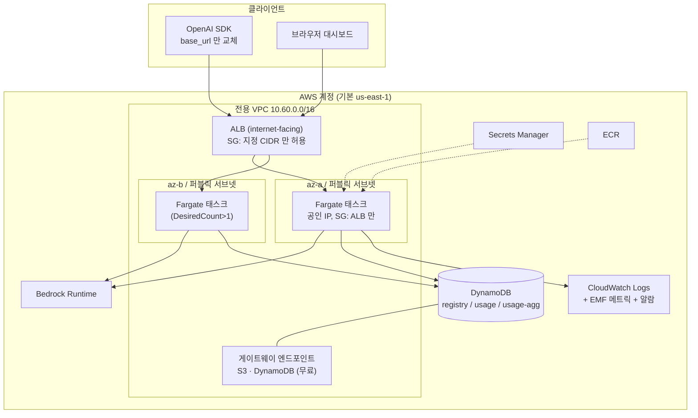
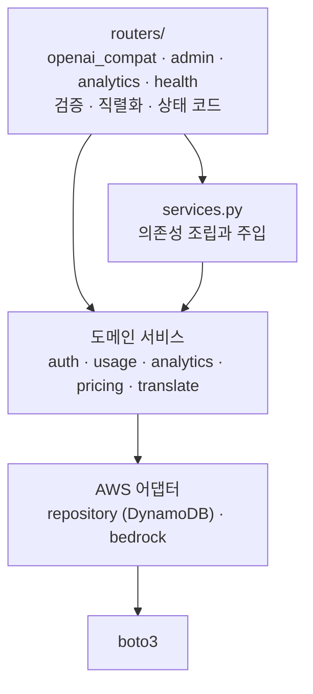
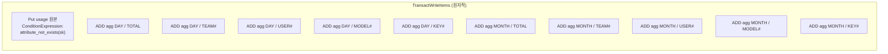
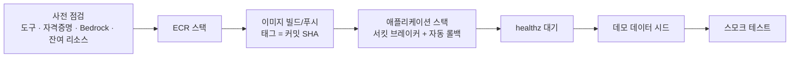

# 아키텍처

## 1. 시스템 구성



## 2. 애플리케이션 레이어

바깥에서 안쪽으로 단방향 의존이다. 도메인 계층은 FastAPI 나 boto3 를 import
하지 않는다.



| 모듈 | 책임 |
|---|---|
| `app.py` | 앱 팩토리, 미들웨어, 예외 핸들러, 정적 파일 마운트 |
| `services.py` | boto3 클라이언트와 도메인 서비스를 프로세스 시작 시 1회 조립 |
| `config.py` | 환경변수 기반 설정 (pydantic-settings) |
| `routers/openai_compat.py` | `/v1/*`. 동기 핸들러로 정의해 boto3 블로킹 호출이 이벤트 루프를 막지 않게 한다 |
| `routers/admin.py` | 계정·팀·사용자·키 CRUD |
| `routers/analytics.py` | 집계 조회. `/analytics/dashboard` 가 한 번에 전부 반환 |
| `routers/health.py` | `/healthz`(얕음, ALB 용), `/readyz`(의존성 확인) |
| `auth.py` | 키 인증, 모델 허용 검사, 예산 검사 |
| `usage.py` | 비용 계산, 사용량 기록, 메트릭 발행 |
| `analytics.py` | 집계 테이블 조회와 축별 합산 |
| `pricing.py` | 단가 표, 모델 ID 정규화, 비용 계산 |
| `translate.py` | OpenAI ↔ Bedrock Converse 변환 (순수 함수) |
| `repository.py` | DynamoDB 접근. boto3 호출이 여기와 `bedrock.py` 에만 존재 |
| `bedrock.py` | Converse / ConverseStream, 에러 → 도메인 예외 변환 |
| `observability.py` | JSON 로거(상관관계 ID), EMF 메트릭 |
| `cache.py` | 계정·팀·사용자 메타데이터 TTL 캐시 (기본 30초) |
| `clock.py` | 시간·ID 주입. 테스트에서 `sleep` 없이 고정 |
| `domain.py` | 도메인 모델과 집계 값 객체 |
| `errors.py` | 도메인 예외. HTTP 상태 코드와 OpenAI 에러 타입을 함께 보유 |

## 3. 데이터 모델

### registry 테이블

단일 테이블에 4종류 엔티티를 담는다. GSI 하나로 계정 전체 목록과 계정별 키
목록을 스캔 없이 읽는다.

| 엔티티 | pk | sk | gsi1pk | gsi1sk |
|---|---|---|---|---|
| 계정 | `ACCOUNT#<aid>` | `META` | `ACCOUNTS` | `ACCOUNT#<aid>` |
| 팀 | `ACCOUNT#<aid>` | `TEAM#<tid>` | - | - |
| 사용자 | `ACCOUNT#<aid>` | `USER#<uid>` | - | - |
| API 키 | `KEY#<sha256>` | `META` | `ACCOUNT#<aid>` | `KEY#<kid>` |

API 키의 파티션 키가 해시라서 인증은 **단일 GetItem** 으로 끝난다. 계정별 키
목록은 GSI 를 쓴다.

### usage 테이블 (원본)

```
pk = <account_id>#<YYYY-MM-DD>
sk = <request_id>
LSI lsi_ts: (pk, ts)
TTL: expires_at (기본 90일)
```

정렬 키는 서버가 요청마다 만드는 `usage_id` 다. 클라이언트가 지정할 수 있는
`X-Request-Id` 를 키로 쓰면, 같은 값을 계속 보내는 것만으로 집계가 멈추고
예산 검사(집계를 읽는다)가 영원히 통과한다. Bedrock 호출은 한 번마다 실제
비용이 발생하므로 호출 횟수만큼 기록해야 한다. `X-Request-Id` 는 레코드의
`request_id` 속성으로 남아 로그 추적에 쓰인다. 시간 역순 조회는 LSI 로 한다.

### usage-agg 테이블 (사전 집계)

```
pk = <account_id>#DAY#<YYYY-MM-DD>   또는   <account_id>#MONTH#<YYYY-MM>
sk = TOTAL | TEAM#<tid> | USER#<uid> | MODEL#<mid> | KEY#<kid>
```

속성은 원자적 `ADD` 로 누적한다: `requests`, `success_requests`,
`error_requests`, `input_tokens`, `output_tokens`, `cost_usd`, `latency_ms_sum`.

최대 지연은 이 테이블에 두지 않는다. `ADD` 로는 최댓값을 누적할 수 없기
때문이다. 평균은 `latency_ms_sum / requests` 로 계산하고, 백분위는 CloudWatch
EMF 메트릭에서 본다.

대시보드는 이 테이블만 읽는다. 요청 수가 100배 늘어도 조회 비용이 변하지 않는다.

## 4. 사용량 기록 트랜잭션

요청 하나당 `TransactWriteItems` 1회로 11개 항목을 쓴다.



이 구조가 주는 것:

- **재전송 안전성.** `ClientRequestToken` 에 `usage_id` 를 넘겨, 네트워크
  오류로 같은 트랜잭션이 두 번 도착해도 집계가 두 번 더해지지 않는다.
  클라이언트의 재시도(= 새 Bedrock 호출)는 별개이며 호출마다 집계된다.
- **지연.** 개별 `UpdateItem` 을 순차 호출하면 왕복 11회다. 트랜잭션은 1회다.
- **정합성.** 원본과 집계가 부분 반영되는 상태가 없다.

대가는 쓰기 용량이다. 트랜잭션 쓰기는 일반 쓰기의 2배를 소비해 요청당 약
22 WRU 다. 100만 요청 기준 약 27 USD 다.

기록 실패는 요청 실패로 이어지지 않는다. Bedrock 응답을 이미 받은 뒤에 집계
실패로 5xx 를 주면 사용자는 비용을 지불하고 결과를 받지 못한다. 대신
`UsageWriteFailures` 메트릭과 알람으로 유실을 감지한다.

## 5. 요청 처리 순서와 실패 시 집계 정책

```mermaid
flowchart TD
  start["요청 수신"] --> rid["요청 ID 확정<br/>X-Request-Id 또는 생성"]
  rid --> authn["인증 (키 해시 조회)"]
  authn -->|실패| e401["401 · 사용량 기록 없음"]
  authn -->|성공| model["모델 허용 검사"]
  model -->|실패| e403["403 · 실패로 집계"]
  model -->|성공| budget["예산 검사<br/>(예산이 설정된 경우만 조회)"]
  budget -->|초과| e429["429 · 실패로 집계"]
  budget -->|통과| xlate["OpenAI → Converse 변환"]
  xlate -->|형식 오류| e400["400 · 실패로 집계"]
  xlate --> call["Bedrock 호출"]
  call -->|오류| eup["4xx/5xx · 실패로 집계"]
  call -->|성공| ok["200 · 성공으로 집계"]
```

401 만 사용량을 남기지 않는다. 호출 주체를 특정할 수 없어 어느 계정에 귀속할지
결정할 수 없기 때문이다. 인증 이후의 모든 실패는 주체가 확정되어 있으므로 실패
요청으로 집계된다. 그래야 대시보드 에러율이 실제 사용 경험을 반영한다.

## 6. 스트리밍

`stream: true` 면 SSE 로 응답한다.

```
data: {"choices":[{"delta":{"role":"assistant","content":""}}], ...}
data: {"choices":[{"delta":{"content":"안"}}], ...}
data: {"choices":[{"delta":{"content":"녕"}}], ...}
data: {"choices":[{"delta":{},"finish_reason":"stop"}],"usage":{...}}
data: [DONE]
```

주의할 점 두 가지가 코드에 반영되어 있다.

1. **상태 코드를 나중에 바꿀 수 없다.** 200 헤더를 보낸 뒤 오류가 나면 SSE 본문에
   에러 프레임을 실어 보내고, 집계에는 실제 실패 코드로 기록한다.
2. **사용량 기록은 `finally` 에 있다.** 클라이언트가 중간에 연결을 끊어도 그때까지
   발생한 토큰 비용이 집계에 남는다.

ALB 유휴 타임아웃(60초)과 컨테이너 keep-alive(65초)를 함께 조정했다. 앱이 먼저
연결을 닫으면 ALB 가 그 연결에 요청을 보내다 502 를 내는 경합이 생긴다.

## 7. 확장 한계와 쿼터

| 항목 | 제약 | 대응 |
|---|---|---|
| Bedrock 모델별 TPM/RPM | 모델·리전마다 다름 | 429 를 `upstream_throttled` 로 전달. 쿼터 증액 신청 |
| DynamoDB 파티션 쓰기 | 파티션당 1,000 WCU | 집계 파티션이 `계정#기간` 이라 한 계정의 초당 처리량에 상한이 생긴다. 한 계정이 초당 수백 요청을 넘기면 파티션 분할(샤드 접미어)이 필요하다 |
| DynamoDB 트랜잭션 | 항목 100개, 4MB | 현재 11개 사용 |
| ALB 대상 | 타깃 그룹당 1,000 IP | Fargate 태스크 수 상한보다 크다 |
| Fargate 온디맨드 | 계정·리전별 vCPU 쿼터 | `MaxCount` 를 쿼터 안에서 설정 |
| 조회 범위 | 93일 | 일별 파티션을 병렬 조회하므로 상한을 둔다 |
| 계정 수 | GSI 단일 파티션 | 계정 목록을 한 파티션에 모아 Query 한다. 수만 계정 규모면 분할 필요 |

## 8. 관측

- **로그**: JSON 한 줄. `service`, `level`, `correlation_id`, `location` 포함.
  상관관계 ID 는 `contextvars` 에 담고 포매터가 자동으로 붙인다. Powertools 의
  `append_keys` 를 쓰지 않은 이유는 그 상태가 로거 인스턴스에 공유되어 동시
  요청 사이에 값이 섞일 수 있기 때문이다.
- **메트릭**: EMF 로 stdout 에 쓰고 CloudWatch Logs 가 자동 추출한다.
  `PutMetricData` 호출이 없어 API 스로틀링과 추가 IAM 권한이 필요 없다.
- **분산 트레이싱**: v1 범위에서 제외했다. 근거와 도입 절차는
  [ADR 0004](adr/0004-region-and-observability.md) 에 있다.

## 9. 배포 흐름



스택을 두 개로 나눈 이유는 순서 의존성이다. ECS 서비스는 ECR 에 이미지가 이미
있어야 태스크를 시작할 수 있다. ECR 스택은 애플리케이션 스택을 지웠다 다시
만들어도 유지되어, 이미지 재빌드 없이 재배포할 수 있다.
